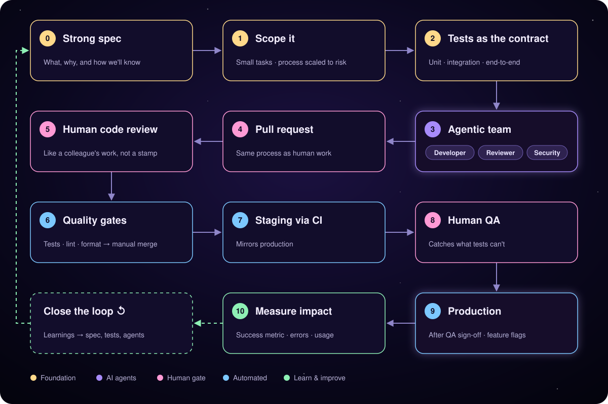

  

<h1 align="center">Hi, I'm Miguel 👋</h1>

<em>Fullstack Product Engineer · Based in Spain</em>

## About me

I'm the engineer you want when a problem needs an owner, not a ticket. Over 4+ years as a fullstack engineer, I've worked across engineering, design and product, and I like owning the whole cycle, from idea to shipped feature.

Lately I've been focused on what happens after launch: defining how to measure a feature's success, designing sound experiments, and building the datasets that show how a product is actually used.

Off-topic, ego-driven fun facts:

- I speak four languages, and one of them is spoken by only about 3.5 million people.
- When a swell hits the coast, I want to be able to grab my board and paddle out. That's my whole reason for staying fit after a day at a screen.

## What I'm working on

<h3>Pitaya</h3>

**Fullstack Engineer - <a href="https://www.transkriptorium.com/">Transkriptorium</a>**

Building an end-to-end document annotation platform to train HTR (handwritten text recognition) models. Think Label Studio, but for old manuscript collections.

<h3>Wolflord</h3>

**Creator · In development**

Wolflord is the game I've always wanted to play but could never find. It is a multiplayer survival game set on a vast island system shared by every player alive: frozen arctic, steaming swamp, scorching desert, and forests. Build fires, hunt, craft, and outlast predators and other players. Every death is permanent. Every sunrise is earned.

**Under the hood**: TypeScript end to end, with Phaser 3 in the browser and Node.js on the server · the server is the single source of truth, and Socket.IO keeps every player in sync in real time · player progress is saved in PostgreSQL (Supabase) · the hard part was a huge island of about 16 million tiles, generated the same way every time and streamed to players piece by piece as they explore

## How I Approach AI-Native Development

> **改善**
>
> *I don't believe in software factories that pump out vibed unreviewed AI code. Instead, I apply Kaizen (改善), the Japanese philosophy of continuous improvement, to AI-native workflows: small, consistent improvements that compound over time.*

  

**0. Start with a strong spec**

A clear, well-defined spec is the foundation. The better the model understands what to build and why, the less time you spend correcting what it builds. The spec also defines how we'll know the feature worked.

**1. Scope it**

I break work into small, well-defined tasks, because agents do their best work on focused problems and small PRs are easier to review. I also scale the process to the risk: a copy change takes the light path, while auth, payments or data migrations get every step below.

**2. Make the tests the contract**

Many people treat the spec or the code as the contract between you and the model. I think the strongest contract is the tests: unit, integration and end-to-end. A spec can be misread and code can drift, but a test passes or it doesn't. This is where I put the pressure.

**3. Generate with an agentic team**

Instead of one model doing everything, I split the work across specialized agents:
- **Developer:** writes the implementation against the tests
- **Reviewer:** checks quality, readability and adherence to the spec
- **Security auditor:** looks for vulnerabilities and unsafe patterns

**4. Open a pull request**

Agent output goes through the same PR process as human work.

**5. Review the code as a human**

I review agent-written code the way I'd review a colleague's: carefully, critically and as a first-class contribution. Not rubber-stamped, and not dismissed.

**6. Automate the quality gates**

Tests, linting and formatting run automatically. Only when everything passes can the PR be merged, and the merge is always manual.

**7. Deploy to staging via CI**

CI deploys the dev branch to a staging environment that mirrors production.

**8. Human QA in staging**

A person validates the feature in a real environment. This catches what tests can't: UX issues, edge cases nobody specified, and things that are technically correct but feel wrong.

**9. Deploy to production**

Only after staging QA signs off, rolled out behind a feature flag when the change is risky.

**10. Measure in production**

Shipping isn't the finish line. I check the success metric defined in the spec, watch errors and performance, and look at how people actually use the feature. If it isn't working, the flag makes it easy to roll back.

### Closing the loop

After every cycle, I feed what went wrong back into the specs, tests and agent instructions, so the next cycle starts better than the last. That's where the Kaizen lives.

## Tech stack

<table>
  <tr>
    <td><strong>Languages</strong></td>
    <td>
      
      &nbsp;
      
      &nbsp;
      
    </td>
  </tr>
  <tr>
    <td><strong>Frontend</strong></td>
    <td>
      
      &nbsp;
      
      &nbsp;
      
      &nbsp;
      
    </td>
  </tr>
  <tr>
    <td><strong>Backend</strong></td>
    <td>
      
      &nbsp;
      
      &nbsp;
      
      &nbsp;
      
    </td>
  </tr>
  <tr>
    <td><strong>Testing</strong></td>
    <td>
      
      &nbsp;
      
      &nbsp;
      
      &nbsp;
      
    </td>
  </tr>
  <tr>
    <td><strong>Infra</strong></td>
    <td>
      
      &nbsp;
      
      &nbsp;
      
      &nbsp;
      
    </td>
  </tr>
  <tr>
    <td><strong>Data</strong></td>
    <td>
      
      &nbsp;
      
    </td>
  </tr>
  <tr>
    <td><strong>Product analytics</strong></td>
    <td>
      
      &nbsp;
      
    </td>
  </tr>
</table>

## Where to find me

If you want to contact me, you can reach me through LinkedIn.

---

<em>Thanks for stopping by! 🩵</em>
